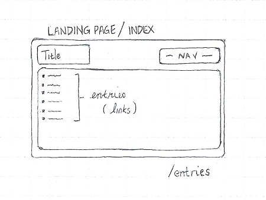
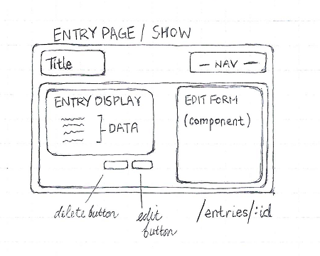
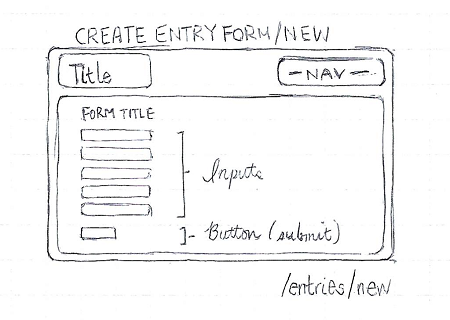
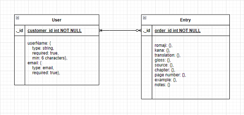

# SFX Glossary-maker

## Introduction

SFX Glossary-maker is an SPA inspired by one of the many capabilities of CAT (Computer Assisted Translation) and TM (Translation Memory) software: creating termbases, or a dataset of terms and phrases stored from a specific text/document that can be easily referenced during the translation process. What I've doned is scaled this down immensely for personal use and, specifically, for manga sound effects as well as onomatopoetic expressions.   

[When ready, deployed project link will be available here.]()

## Explanation of Technologies Used

This app is created using the MERN stack: MongoDB for data storage, Express and Node.js for backend build, and React for frontend build. I started by cloning the starter code from Abraham Tavarez's [MERN-instracture-p1](https://github.com/AbeTavarez/MERN-infrastructure-P1.git), which is the basis for in-class code alongs for building a backend with user authentication. Adjustments to the code were made to fit the needs of the app.

## Approach  

For a tool intended as a handy reference tool for translation, I tried to minimize "page jumps" while keeping views functional. After logging in, the user is brought to a landing page where all current SFX entries are listed by name. A header keeps the title and navigation in view. 

The "edit" function can be accessed the single entry (show) page. This way, relevant notes and changes be added without a huge break in the process.

Creating new entries constitutes a break in process, so the form for that is hosted on a separate "page". 

As for data, you can see from the ERD below that there are only two data entities: one for users and one for SFX entries. Each entry has to be created by at least one user, but no user is required to create an entry.

For more on the nuts and bolts of the building process, please see my [Trello board](https://trello.com/invite/b/uPVx26Wg/ATTI17e9b43ee9a2616a100a830cf0e06df188C689F2/glossary-app).      

## Unsolved Problems

This is short list of unsolved problems:  

- Edit button 
    - not linked to Edit Form component 
    - not set to toggle visibility of Edit Form component 
- Inconsistency in whether (prefilled) defaultValues in Edit Form are rendered in updates
- Built-in page navigation/refreshes not working consistently
- App is not yet deployed

## Future Enhancements

Some upcoming builds include: 

- Form/User features
    - Allowing different users to add, sign, and display their updates on existing entries
    - More intuitive interface for editing each entry element 
- Rendering features
    - Add categories for entries, such as letters of the alphabet, for better display as number of entries grow
    - Add sorting capability to allow entries to be filtered and displayed based on different data points 

## References/Research

Resources on CAT/TM Tools: [Trados "Translation 101"](https://www.trados.com/solutions/cat-tools/translation-101-what-is-a-cat-tool.html) | [memoq webinar](https://www.memoq.com/resources/webinars/memoq-getting-started-translators) | [Phrase blog guide](https://phrase.com/blog/posts/cat-tools/)

Key references for build: [Abraham Tavarez's MERN-infractructure app](https://github.com/AbeTavarez/MERN-infrastructure-P1.git) | Per Scholas course materials and past code-alongs | [MERN Tutorial by The Net Ninja](https://youtu.be/98BzS5Oz5E4)

## Acknowledgements
  
Thank you to my patient and generous instructors and co-learners. It's been uplifting and real to code with you all!