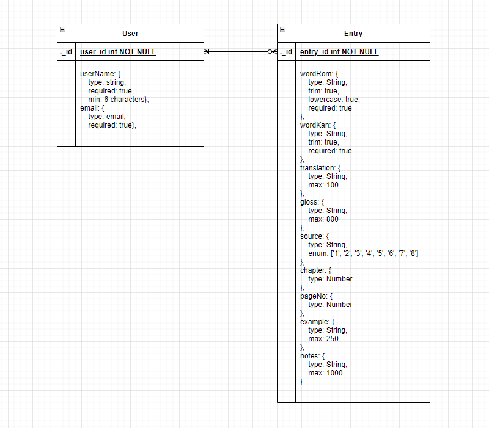

# SFX Glossary-maker

## Introduction

SFX Glossary-maker is an SPA inspired by one of the many capabilities of CAT (Computer Assisted Translation) and TM (Translation Memory) software: the ability to create termbases, a database of terms and phrases stored from a project you are translating that can be easily accessed for your reference. What I've doned is scaled this down immensely for personal use and, specifically, for manga sound effects and onomatopoetic expressions.   

## Explanation of Technologies Used

## Approach  

For a tool intended to act as a reference tool for translation, I tried to minimize "page jumps" while keeping views functional. After logging in, the user is brought to a landing page where all current SFX entries are listed by name. A header keeps the title and navigation in view. 

The "edit" function can be accessed the single entry (show) page. This way, relevant notes and changes be added without a huge break in the process.

Creating new entries constitutes a break in process, so the form for that is hosted on a separate "page". 

As for data, you can see from the ERD below that there are only two data entities: one for users and one for SFX entries. Each entry has to be created by at least one user, but no user is required to create an entry.

For more on the nuts and bolts of the building process, please see my [Trello board](https://trello.com/invite/b/uPVx26Wg/ATTI17e9b43ee9a2616a100a830cf0e06df188C689F2/glossary-app).      

## Unsolved Problems

This app is not yet deployed.

## Future Enhancements

Something that would check for multiple entries with same string and assign it a different name. 

A form feature that would allow users to sign additions and edits to entries and have them displayed as such.

Add categories to be able to include not just SFX, but also other recurring terms and reference lists.

Display in alphabetical order.

## References/Research

Resources on CAT/TM Tools: [Trados "Translation 101"](https://www.trados.com/solutions/cat-tools/translation-101-what-is-a-cat-tool.html) | [memoq webinar](https://www.memoq.com/resources/webinars/memoq-getting-started-translators) | [Phrase blog guide](https://phrase.com/blog/posts/cat-tools/)